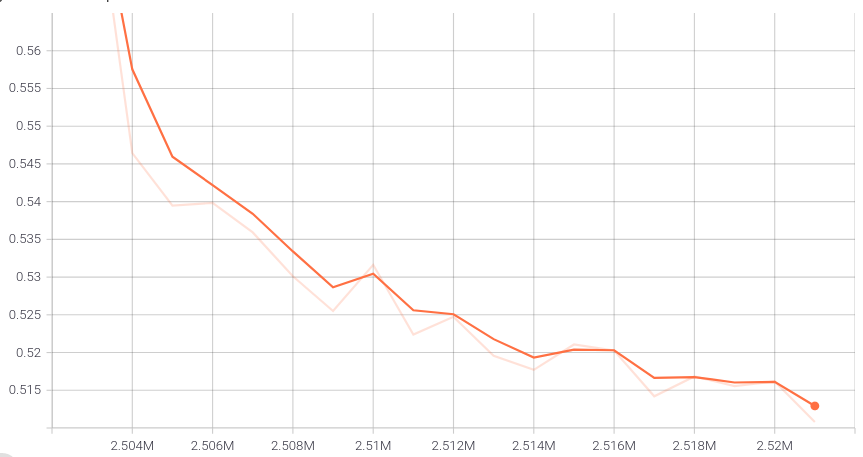

# HiFi-GAN for Vietnamese Speech Synthesis


## **Pre-requisites**
1. Python >= 3.6
2. Clone this repository.
3. Install requirements.
4. Download the [preprocessed VIVOS dataset]() (contains GTA Tacotron2 mel-spectrograms).

## **Pretrained Model**
You can also use pretrained models we provide.<br/>
[Download pretrained models](https://drive.google.com/drive/folders/1_WA_FTvO1V3h87suI0b9vdAGy1zDCGPy?usp=sharing)<br/> 
Details of each folder are as in follows:

|Folder Name|Generator|Dataset|Fine-Tuned|
|------|---|---|---|
|VIVOS_V1|V1|preprocessed VIVOS|Yes ([Tacotron2](https://github.com/sasukepn1999/tacotron2))|
|UNIVERSAL_V1|V1|Universal|No|

Pretrained model with discriminator and generator weights that can be used as a base for transfer learning to other datasets.


## **Training with Fine-tuning**
Generated mel-spectrograms in numpy format using Tacotron2 with teacher-forcing (GTA) <br>
are provided in **preprocessed VIVOS dataset**.
```
python train.py --training_epochs 1000 --config config_v1.json \ 
--train_wavs_dir [vivos train waves dir] \
--val_wavs_dir [vivos test waves dir] \
--train_mels_dir [vivos train mels dir] \
--val_mels_dir [vivos test mels dir]
```
To train V2 or V3 Generator, replace `config_v1.json` with `config_v2.json` or `config_v3.json`.<br>
Checkpoints and copy of the configuration file are saved in `cp_hifigan` directory by default.<br>
You can change the path by adding `--checkpoint_path` option.

Validation loss during training with V1 generator.<br>


## **Inference from wav file**
```
python inference_wav.py 
--input_wavs_dir [wavs dir] \
--checkpoint_file [generator checkpoint file path]
```
Generated wav files are saved in `generated_files` by default,<br>
you can change the path by adding `--output_dir` option. <br>
**config.json** file must be in same folder with checkpoint file.


## **Inference from mel-spectrogram**
```
python inference_mel.py \
--input_mels_dir [mels dir] \
--checkpoint_file [generator checkpoint file path]
```
Generated wav files are saved in `generated_files_from_mel` by default.<br>
You can change the path by adding `--output_dir` option. <br>
**config.json** file must be in same folder with checkpoint file.
